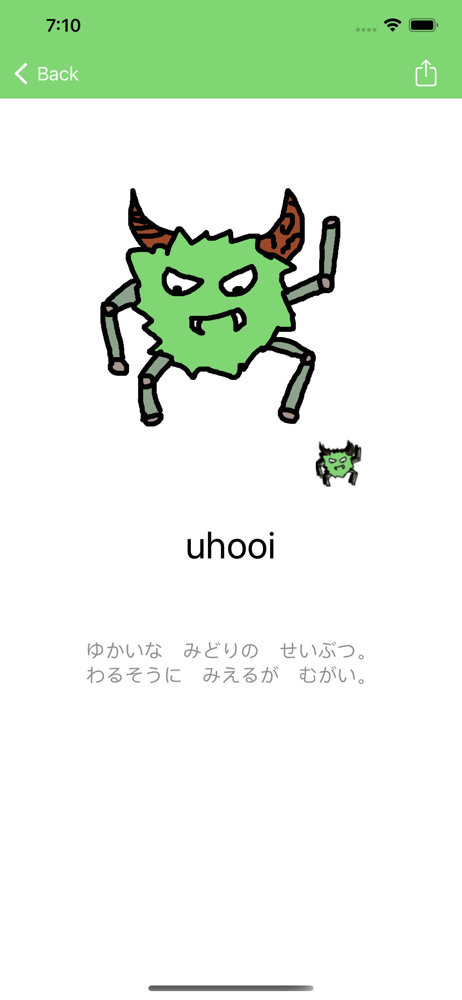

[英語](./README.md) / 日本語

# UhooiPicBook-iOS

[](https://github.com/uhooi/UhooiPicBook/releases/latest)
[](https://github.com/uhooi/UhooiPicBook/blob/main/LICENSE)
[](https://github.com/uhooi/UhooiPicBook)
[](https://twitter.com/the_uhooi)

|ブランチ|CI|コードカバレッジ|
|:--|:--:|:--:|
|[main](https://github.com/uhooi/UhooiPicBook/tree/main)|[](https://github.com/uhooi/UhooiPicBook/actions/workflows/main.yml)|-|
|[develop](https://github.com/uhooi/UhooiPicBook/tree/develop)|[](https://github.com/uhooi/UhooiPicBook/actions/workflows/main.yml)|-|


UhooiPicBook-iOSは、ウホーイのiOS用キャラクター図鑑です。

<a href="https://apps.apple.com/jp/app/ウホーイ図鑑/id1501657213?itsct=apps_box_badge&amp;itscg=30200" style="display: inline-block; overflow: hidden; border-radius: 13px; width: 250px; height: 83px;"></a>

## 目次

- [スクリーンショット](#スクリーンショット)
- [開発](#開発)
- [貢献](#貢献)
- [スタッツ](#スタッツ)

## スクリーンショット

<details><summary>スクリーンショット</summary>

### ライト

|モンスター一覧|モンスター詳細|画像ポップアップ|
|:--:|:--:|:--:|
||||

|モンスター一覧で開いたメニュー|Spotlight|iMessage|
|:--:|:--:|:--:|
||||

|ウィジェット|
|:--:|
||

### ダーク

|モンスター一覧|モンスター詳細|画像ポップアップ|
|:--:|:--:|:--:|
||||

|モンスター一覧で開いたメニュー|Spotlight|iMessage|
|:--:|:--:|:--:|
||||

|ウィジェット|
|:--:|
||

</details>

## 開発

誰でもこのプロジェクトを開発できます。

### 必要条件

- macOS 12.5+
- Xcode 14.2 (Swift 5.7.2)
- Make

### 構成

- UIの実装: Storyboard + XIB
- アーキテクチャ: VIPER
- UIテストのアーキテクチャ: Page Object Pattern
- ブランチモデル: Git-flow

### セットアップ

1. このプロジェクトをクローンします。  
    ```shell
    $ git clone https://github.com/uhooi/UhooiPicBook.git
    $ cd UhooiPicBook
    ```

2. Swiftプロジェクトの高速ビルドを有効にします。（任意）  
    ```shell
    $ defaults write com.apple.dt.XCBuild EnableSwiftBuildSystemIntegration 1
    ```

3. `make setup` を実行します。  
セットアップが完了すると、自動的にXcodeでワークスペースが開きます。

### ヘルプ

`make help` を実行します。

```shell
$ make help
setup                                Install dependencies and prepared development configuration
build-cli-tools                      Build CLI tools managed by SwiftPM
download-firebase-sdk                Download firebase-ios-sdk
generate-licenses                    Generate licenses with LicensePlist
generate-mocks                       Generate mocks with Mockolo
open                                 Open workspace in Xcode
clean                                Delete cache
clean-cli-tools                      Delete build artifacts for CLI tools managed by SwiftPM
analyze                              Analyze with SwiftLint
build-debug-develop                  Xcode debug build for develop
build-debug-production               Xcode debug build for production
test-debug-develop                   Xcode debug test for develop
test-debug-production                Xcode debug test for production
test-debug-app-module                Xcode debug test for AppModule
merge-test-results                   Merge test results
show-devices                         Show devices
```

## 貢献

貢献をお待ちしています :relaxed:

- [新しいイシュー](https://github.com/uhooi/UhooiPicBook/issues/new)
- [新しいプルリクエスト](https://github.com/uhooi/UhooiPicBook/compare)

## スタッツ

[](https://github.com/uhooi/UhooiPicBook)
