# UhooiPicBook-iOS

[](https://github.com/uhooi/UhooiPicBook/releases/latest)
[](https://github.com/uhooi/UhooiPicBook/blob/main/LICENSE)
[](https://github.com/uhooi/UhooiPicBook)
[](https://twitter.com/the_uhooi)

|Branch|CI|Code coverage|
|:--|:--|:--|
|[main](https://github.com/uhooi/UhooiPicBook/tree/main)|[](https://github.com/uhooi/UhooiPicBook/actions/workflows/main.yml)|[](https://codecov.io/gh/uhooi/UhooiPicBook)|
|[develop](https://github.com/uhooi/UhooiPicBook/tree/develop)|[](https://github.com/uhooi/UhooiPicBook/actions/workflows/main.yml)|[](https://codecov.io/gh/uhooi/UhooiPicBook)|

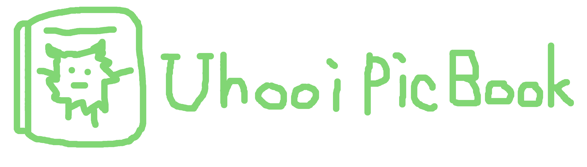

UhooiPicBook-iOS is Uhooi's character book for iOS.

[](https://apps.apple.com/jp/app/id1501657213)

## Screenshots

### Light

|MonsterList|MonsterDetail|ImagePopup|
|:--|:--|:--|
|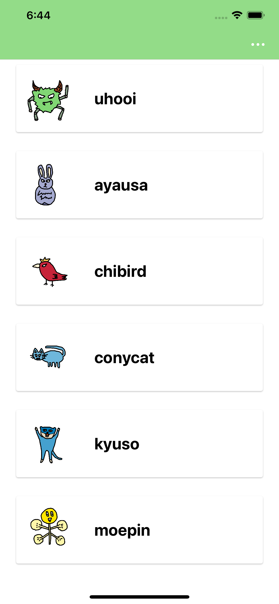|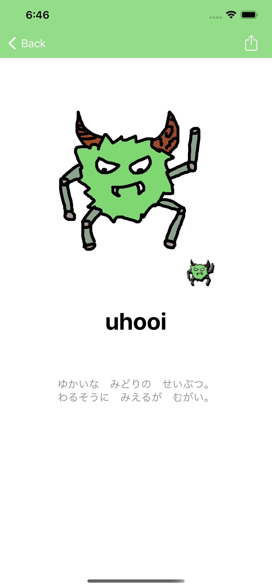|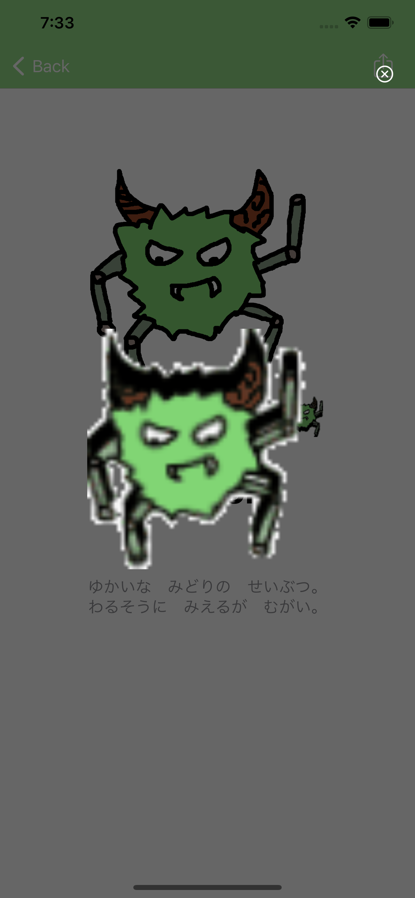|

|Menu opened in MonsterList|Spotlight|iMessage|
|:--|:--|:--|
|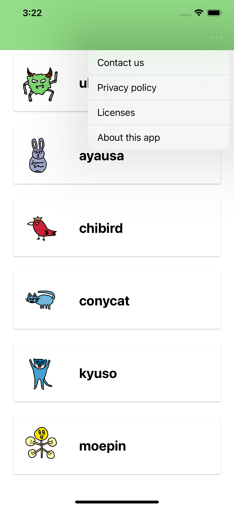|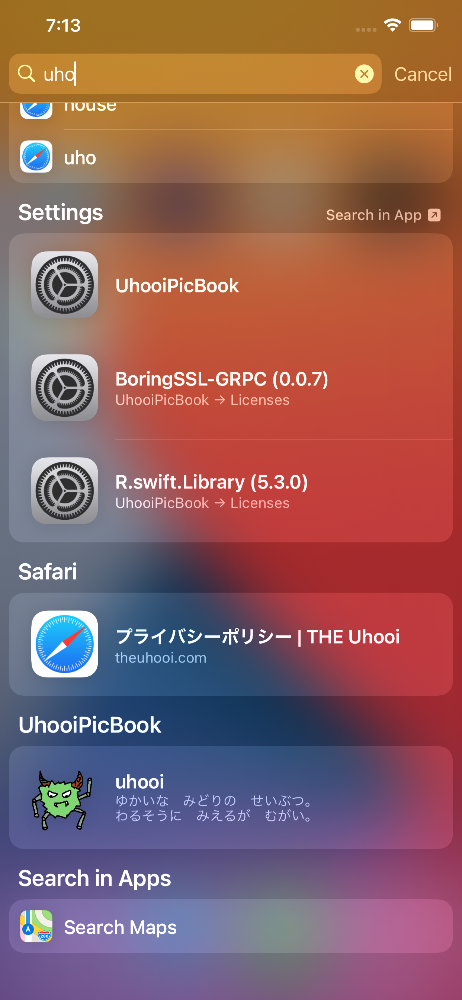|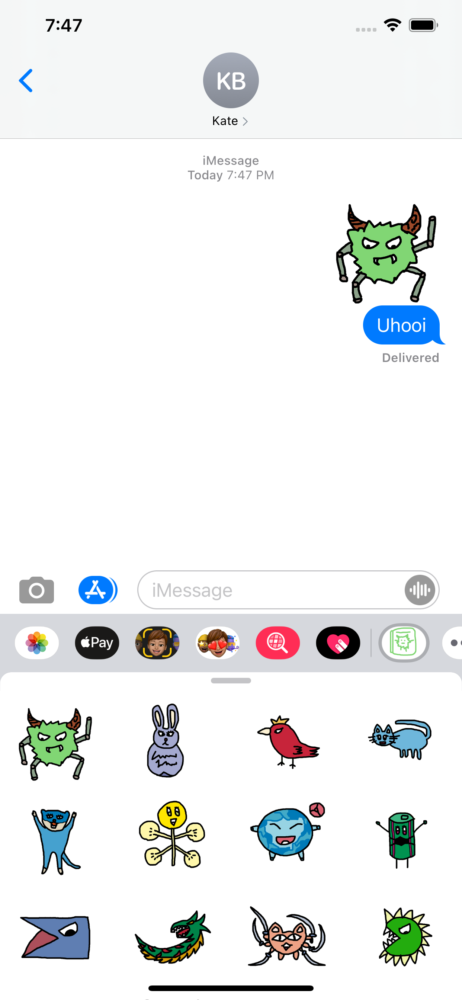|

|Widgets|
|:--|
||

### Dark

|MonsterList|MonsterDetail|ImagePopup|
|:--|:--|:--|
|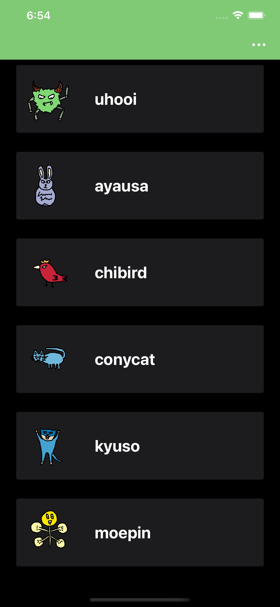|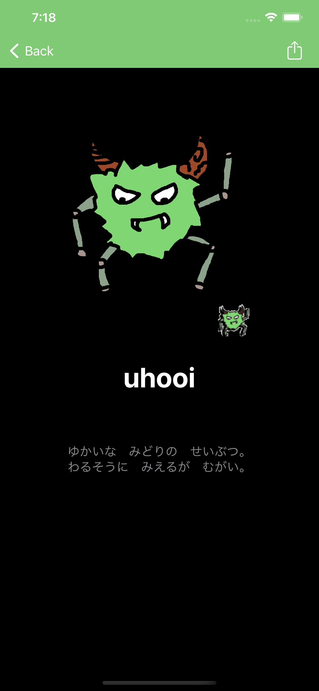|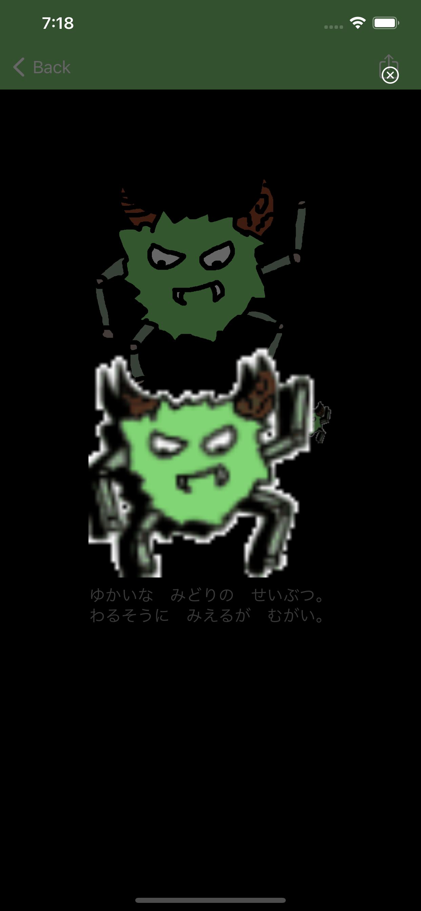|

|Menu opened in MonsterList|Spotlight|iMessage|
|:--|:--|:--|
|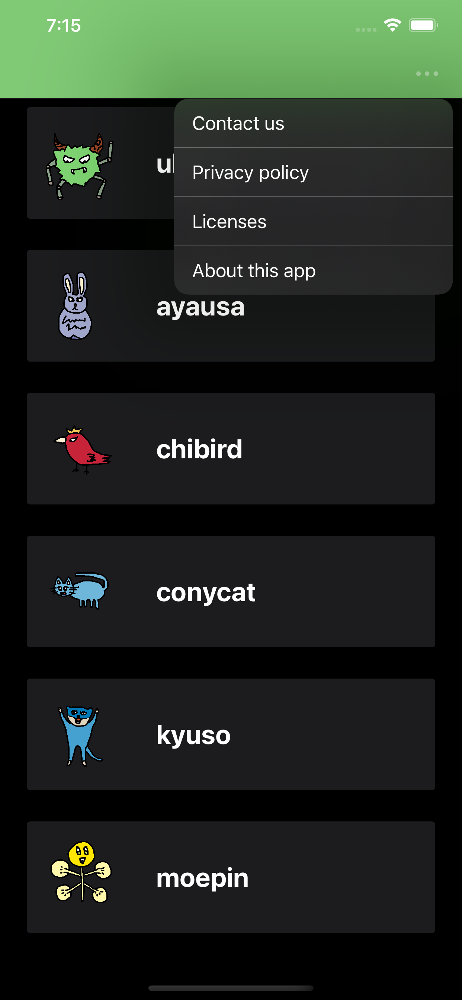|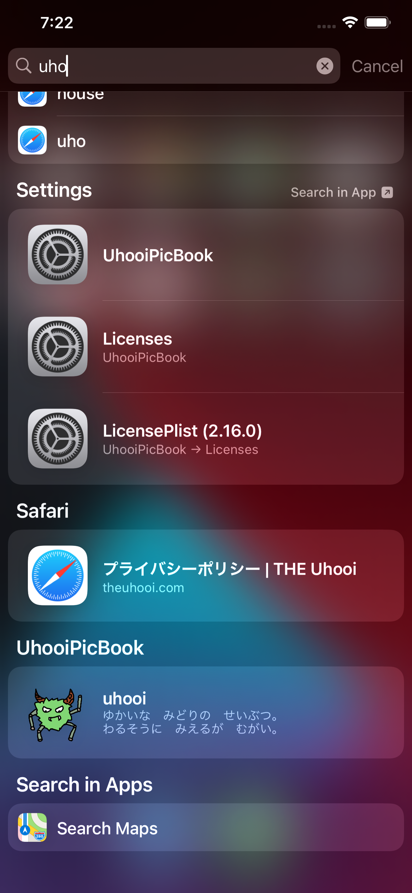|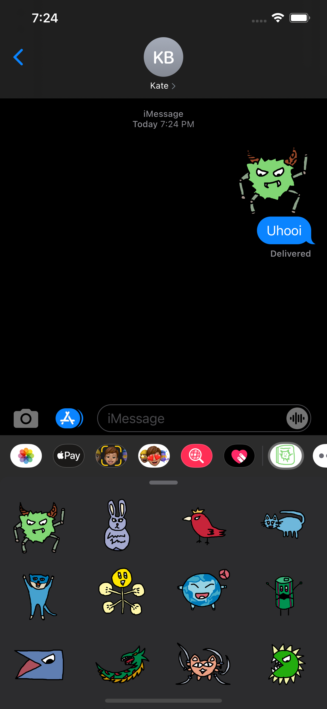|

|Widgets|
|:--|
||

## Development

You can develop this project.

### Configuration

- UI implementation: Storyboard + XIB
- Architecture: VIPER
- UITesting architecture: Page Object Pattern
- Branching model: Git-flow

### Setup

1. Install the following tools.

- [Xcode](https://apps.apple.com/jp/app/xcode/id497799835): 12.5.1
- [rbenv](https://github.com/rbenv/rbenv): 1.1.2

2. Clone the project.

```shell
$ git clone https://github.com/uhooi/UhooiPicBook.git
$ cd UhooiPicBook
```

3. Run `make setup` .  
After setup is complete, Workspace automatically opens in Xcode.

### Help

Run `make help` .

```shell
$ make help
setup                                      Install dependencies and prepared development configuration
install-bundler                            Install Bundler dependencies
update-bundler                             Update Bundler dependencies
install-templates                          Install Generamba templates
generate-licenses                          Generate licenses with LicensePlist
generate-module MODULE_NAME=[module name]  Generate module with Generamba
generate-xcodeproj-develop                 Generate project with XcodeGen for develop
generate-xcodeproj-production              Generate project with XcodeGen for production
open                                       Open project in Xcode
clean                                      Delete cache
clean-swift-packages                       Delete build artifacts
analyze                                    Analyze with SwiftLint
build-debug                                Xcode build for debug
test TEST_DEVICE=[device] TEST_OS=[OS]     Xcode test
get-coverage-html                          Get code coverage for HTML
get-coverage-cobertura                     Get code coverage for Cobertura
upload-coverage                            Upload code coverage to Codecov
show-devices                               Show devices
```

## Contribution

I would be happy if you contribute :)

- [New issue](https://github.com/uhooi/UhooiPicBook/issues/new)
- [New pull request](https://github.com/uhooi/UhooiPicBook/compare)
