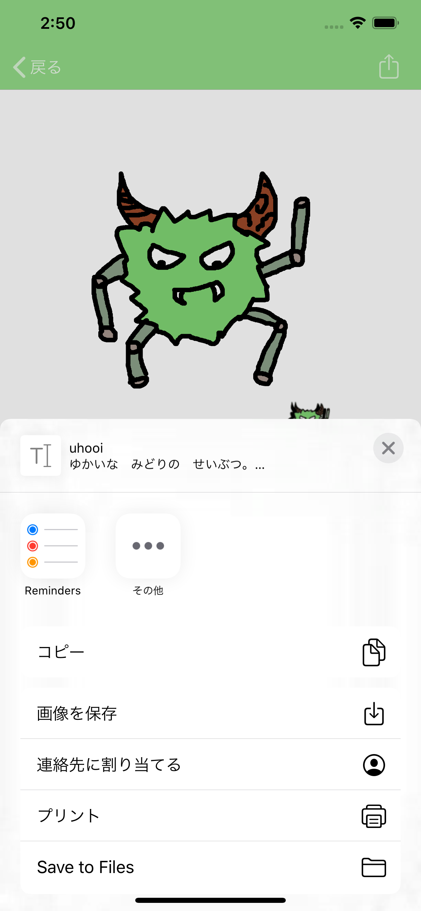
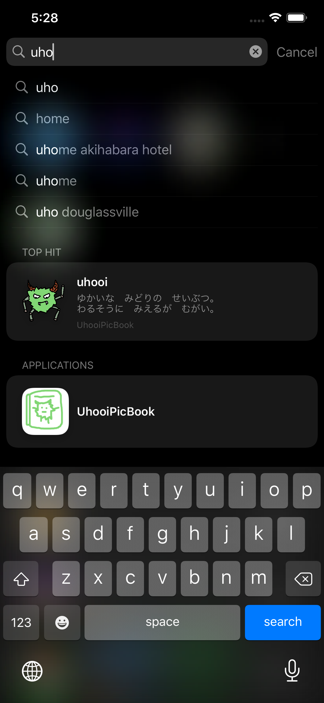
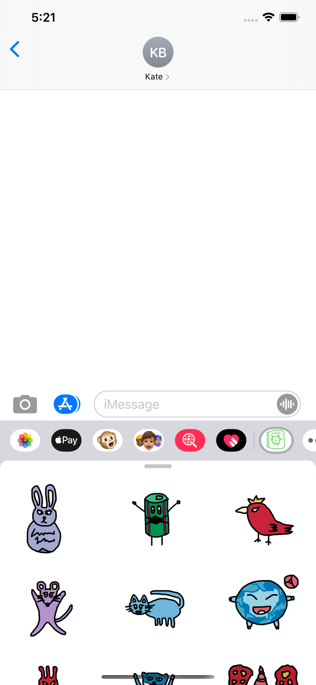

# UhooiPicBook-iOS

[](https://github.com/uhooi/UhooiPicBook/actions?query=workflow%3ACI)
[](https://github.com/uhooi/UhooiPicBook/blob/master/LICENSE)
[](https://twitter.com/the_uhooi)


UhooiPicBook-iOS is Uhooi's character book for iOS.

[](https://apps.apple.com/jp/app/id1501657213)

## Screenshots

|MonsterList|MonsterDetail|ImagePopup|
|:--|:--|:--|
||||

|Activity|Spotlight|
|:--|:--|
|||

__iMessage__

|1|2|3|4|
|:--|:--|:--|:--|
|||||

## Development

You can develop UhooiPicBook-iOS.

### Environment

- Xcode: 11.6
- Swift: 5.2.4
- Bundler: 2.1.4
- Mint: 0.14.2

### Configuration

- UI implementation: Storyboard + XIB
- Architecture: VIPER
- UITesting architecture: Page Object Pattern
- Branching model: Git-flow

### Setup

1. Install [Bundler](https://github.com/rubygems/bundler) and [Mint](https://github.com/yonaskolb/Mint) .

2. Clone the project.

```
$ git clone https://github.com/uhooi/UhooiPicBook.git
$ cd UhooiPicBook
```

3. Run `make setup` .  
After setup is complete, Workspace automatically opens in Xcode.

### Help

Run `make help` .

```
$ make help
setup                                      Install dependencies and prepared development configuration
install-bundler                            Install Bundler dependencies
update-bundler                             Update Bundler dependencies
install-mint                               Install Mint dependencies
install-cocoapods                          Install CocoaPods dependencies and generate workspace
update-cocoapods                           Update CocoaPods dependencies and generate workspace
install-carthage                           Install Carthage dependencies
update-carthage                            Update Carthage dependencies
install-templates                          Install Generamba templates
generate-licenses                          Generate licenses with LicensePlist and regenerate project
generate-module MODULE_NAME=[module name]  Generate module with Generamba and regenerate project
generate-xcodeproj                         Generate project with XcodeGen
open                                       Open workspace in Xcode
clean                                      Delete cache
build-debug                                Xcode build for debug
test TEST_DEVICE=[device] TEST_OS=[OS]     Xcode test
get-coverage                               Get code coverage
show-devices                               Show devices
```

## Contribution

I would be happy if you contribute :)

- [New issue](https://github.com/uhooi/UhooiPicBook/issues/new)
- [New pull request](https://github.com/uhooi/UhooiPicBook/compare)
