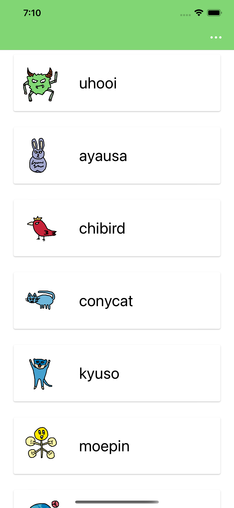
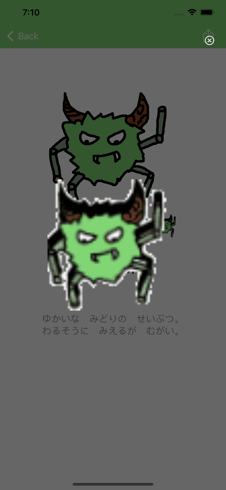
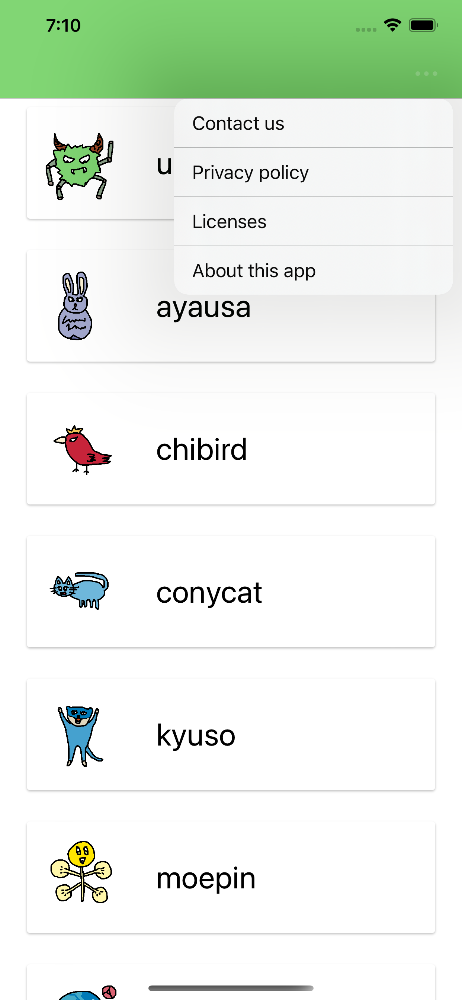
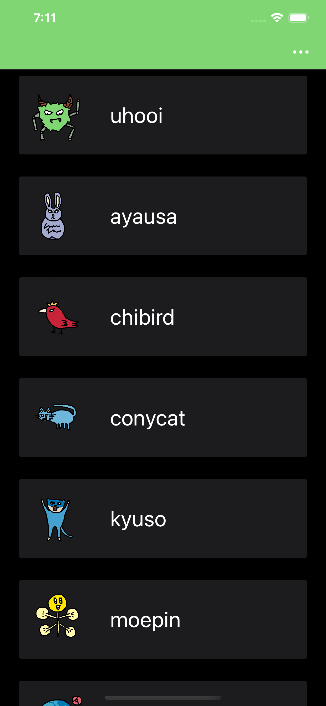

English / [Japanese](./README.ja.md)

# UhooiPicBook-iOS

[](https://github.com/uhooi/UhooiPicBook/releases/latest)
[](https://github.com/uhooi/UhooiPicBook/blob/main/LICENSE)
[](https://github.com/uhooi/UhooiPicBook)
[](https://twitter.com/the_uhooi)

|Branch|CI|Code coverage|
|:--|:--:|:--:|
|[main](https://github.com/uhooi/UhooiPicBook/tree/main)|[](https://github.com/uhooi/UhooiPicBook/actions/workflows/main.yml)|-|
|[develop](https://github.com/uhooi/UhooiPicBook/tree/develop)|[](https://github.com/uhooi/UhooiPicBook/actions/workflows/main.yml)|-|


UhooiPicBook-iOS is Uhooi's character book for iOS.

<a href="https://apps.apple.com/jp/app/ウホーイ図鑑/id1501657213?itsct=apps_box_badge&amp;itscg=30200" style="display: inline-block; overflow: hidden; border-radius: 13px; width: 250px; height: 83px;"></a>

## Table of Contents

- [Screenshots](#screenshots)
- [Development](#development)
- [Contribution](#contribution)
- [Stats](#stats)

## Screenshots

<details><summary>Screenshots</summary>

### Light

|MonsterList|MonsterDetail|ImagePopup|
|:--:|:--:|:--:|
||||

|Menu opened in MonsterList|Spotlight|iMessage|
|:--:|:--:|:--:|
||||

|Widgets|
|:--:|
||

### Dark

|MonsterList|MonsterDetail|ImagePopup|
|:--:|:--:|:--:|
||||

|Menu opened in MonsterList|Spotlight|iMessage|
|:--:|:--:|:--:|
||||

|Widgets|
|:--:|
||

</details>

## Development

You can develop this project.

### Environment

- macOS 13.5+
- Xcode 15.2 (Swift 5.9.2)
- Mint
- Make

### Configuration

- UI implementation: Storyboard + XIB
- Architecture: VIPER
- UITesting architecture: Page Object Pattern
- Branching model: Git-flow

### Setup

1. Clone the project.  
    ```shell
    $ git clone https://github.com/uhooi/UhooiPicBook.git
    $ cd UhooiPicBook
    ```

2. Enable faster builds for Swift projects. (Optional)  
    ```shell
    $ defaults write com.apple.dt.XCBuild EnableSwiftBuildSystemIntegration 1
    ```

3. Run `make setup` .  
After setup is complete, Workspace automatically opens in Xcode.

### Help

Run `make help` .

```shell
$ make help
setup                                Install dependencies and prepared development configuration
install-mint-dependencies            Install Mint dependencies
download-firebase-sdk                Download firebase-ios-sdk
generate-licenses                    Generate licenses with LicensePlist
generate-mocks                       Generate mocks with Mockolo
open                                 Open workspace in Xcode
clean                                Delete cache
lint                                 Lint with SwiftLint
fix                                  Fix with SwiftLint
analyze                              Analyze with SwiftLint
lint-ib                              Lint with IBLinter
build-debug-develop                  Xcode debug build for develop
build-debug-production               Xcode debug build for production
test-debug-develop                   Xcode debug test for develop
test-debug-production                Xcode debug test for production
test-debug-app-module                Xcode debug test for AppModule
merge-test-results                   Merge test results
show-devices                         Show devices
```

## Contribution

I would be happy if you contribute :)

- [New issue](https://github.com/uhooi/UhooiPicBook/issues/new)
- [New pull request](https://github.com/uhooi/UhooiPicBook/compare)

## Stats

[](https://github.com/uhooi/UhooiPicBook)
